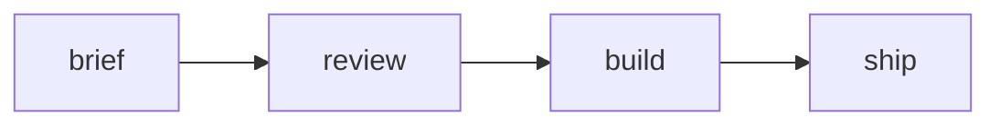

# Rollout plan

An agent wrote this. It is the fixture for the Phase 1 gate: five numbered
sections so an external rewrite can touch 1 and 5 while section 3 is being
edited, a task table with owners, a diagram, and code.

## 1. Scope

The first release covers reading a plan, marking it up, and handing it back.
Everything else waits for the loop in phase two.

## 2. Tasks

| Task | Owner | Due |
|---|---|---|
| Write the brief | Owner: Sam | 2026-09-15 |
| Review with the team | Owner: Ana | 2026-09-18 |
| Ship the first build | Owner: Lee | 2026-09-22 |

## 3. Sequence



The order matters more than the dates do. Nothing after the review can start
until the brief is agreed, and the build is the only step with slack in it.

## 4. Checks

- [ ] Decide the licence
- [x] Set up CI
- Round trip the corpus on both engines

```js
const ready = true;
```

> [!note] Callouts render with a header.
> Inline math like $E = mc^2$ and ==highlights== show in the preview.

## 5. Risks

We will do all of this in a single two-week sprint, ship on the Tuesday, and
still have time to write the documentation. The licence question is the only
one that could stop us, and it is not a technical one.
